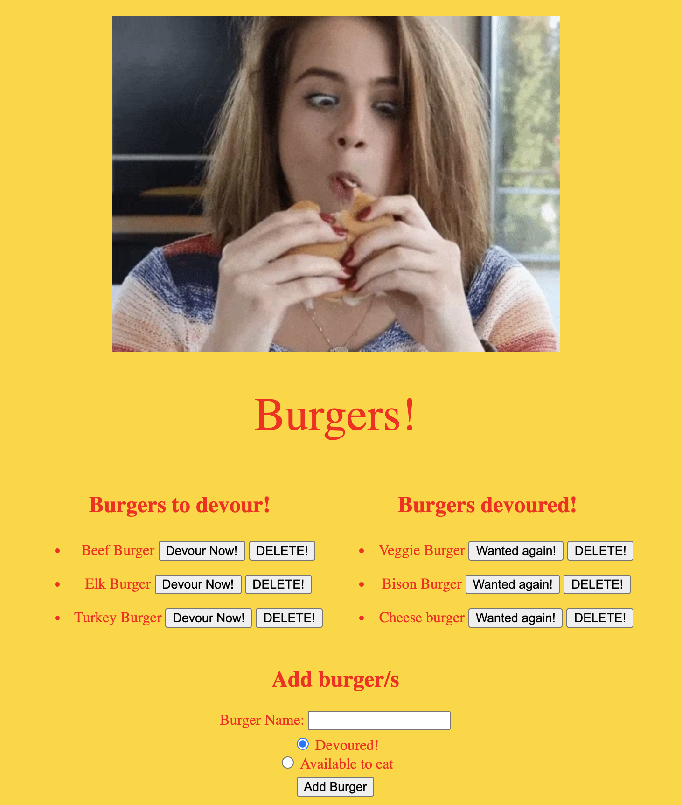

# Eat-Da-Burger
A burger logger app with MySQL, Node, Express, Handlebars and a homemade ORM (yum!). 

## Description 
  

The task was to create a burger logger with MySQL, Node, Express, Handlebars and a homemade ORM following the MVC design pattern; and using Node and MySQL to query and route data, and Handlebars to generate HTML.

Eat-Da-Burger! is a restaurant app that lets users input the names of burgers they'd like to eat. Whenever a user submits a burger's name, the app will display the burger on the left side of the page -- waiting to be devoured. Each burger in the waiting area also has a 'Devour it!' button. When the user clicks it, the burger will move to the right side of the page. There is also a 'Throw it up!' button which when clicked moves the burger back to the left hand side ready to be eaten again. The app stores every burger in a database, whether devoured or not.

## Table of Contents
- [Eat-Da-Burger](#eat-da-burger)
  - [Description](#description)
  - [Table of Contents](#table-of-contents)
  - [Installation](#installation)
  - [Usage](#usage)
  - [Technologies](#technologies)
  - [Credits](#credits)
  - [Contributing](#contributing)
  - [License](#license)

## Installation
If running the project from localhost:
1. `npm init` to install package.json
2. `npm install MySql`, `npm install express` and `npm install express-handlebars` (required dependencies)
3. In the terminal run `node server.js`
4. Open browser at the linked port
5. See GIF below for how to use

If running the project from Heroku:
1. Click on deployed link below and use according to the GIF below.

## Usage
The URL of the git hub repository is https://github.com/raed-ra/H13-eatdaburger

The URL of the deployed application is https://eat-da-burger-raed.herokuapp.com/

The following GIF shows the application's functionality and how to use. 

## Technologies
NPM, Node js, Inquirer, mySQL

## Credits
- Team at UWA Coding Bootcamp

## Contributing

## License
MIT

